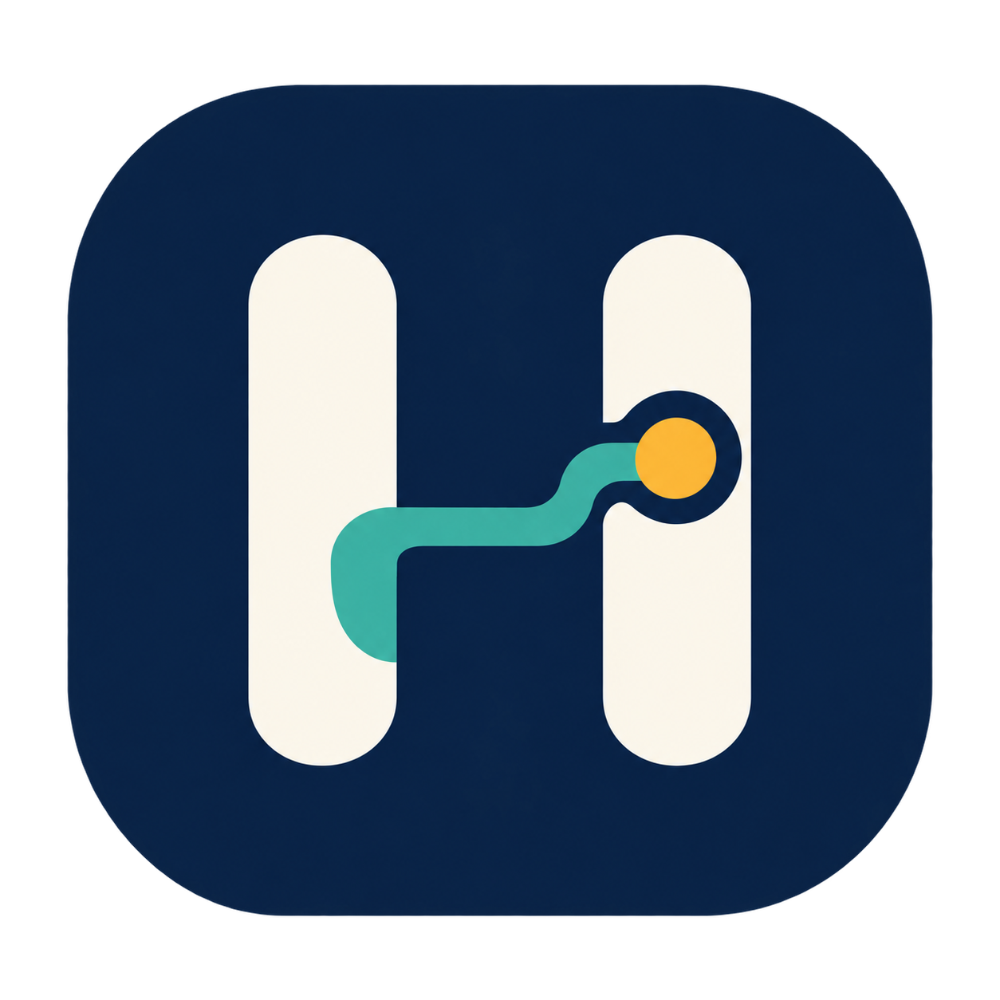

<a id="english"></a>

# Harness Control Terminal



[](#english)
[](#中文)

[](https://github.com/QiushanHuang/Harness-Control-Terminal/releases)
[](https://github.com/QiushanHuang/Harness-Control-Terminal/releases)
[](LICENSE)

**Keep the task, the AI result and the reason you accepted it in one place.**

An agent finishes a run. The result is in one folder, the requirements are in a
chat, and your task board says "done". A week later, you need to know which result
you actually checked. Harness connects those pieces in a local project workbench.

## Why choose Harness?

Use Harness when AI-assisted work outlasts a single conversation. Its advantage
is the connection between planning and acceptance: each saved result belongs to
a task version, with a checklist and a recorded decision you can find later.

| Friction in an everyday workflow | What Harness changes | What you gain |
| --- | --- | --- |
| Requirements disappear into long chats. | Keep explicit criteria beside each task. | A clear definition of done before starting. |
| A task board shows status, while output and test results live elsewhere. | Link execution records and frozen results to the task. | Inspect what actually came back without reconstructing the run. |
| A revised task still points to an old "approved" file. | Bind artifacts and decisions to task versions. | Old results stay available without being mistaken for current acceptance. |
| It's hard to remember why you chose a result. | Save adopt/reject reasons and the checklist used at that time. | Search the decision, not just the filename. |
| Switching between files, plans and dependencies breaks concentration. | Use a board, dependency graph, Next Up view and file pointers together. | See what can move forward and what it needs. |

### Where it helps

- Preparing a research or project brief: write the expected sections, generate a
  draft, inspect the saved document and keep your acceptance notes beside it.
- Maintaining this workbench: run a bounded Python change in an isolated copy,
  inspect its patch and test outcome, then decide what to adopt.
- Picking up a project after a break: open Next Up, follow dependencies and
  search earlier decisions without rereading every conversation.

Keep your editor, terminal and file manager. Harness is the project record that
connects their outputs. It is a single-user workbench; current code execution is
scoped to registered workbench Python files, while document tasks can be run
directly. The interface currently uses Simplified Chinese.

## A quick tour

| Need to… | Start here |
| --- | --- |
| Organize work | Create a project, then tasks with one criterion per line |
| See the order of work | Open **依赖图** (dependencies) or **下一步** (Next Up) |
| Ask the local agent for a document | Open **执行记录**, select the task and local document mode |
| Review a result | Choose **归档并进入验收**, then open its frozen content |
| Keep a decision | Check the criteria and record **采用** or **拒绝** with a reason |
| Mark the task accepted | Use **确认人工验收** after reviewing the current result |
| Find an earlier decision | Search **全局查找**, then open its task |
| Share project metadata | Export Markdown, JSON or MindDesk-compatible references |

"Adopt" records your choice. Applying a code patch remains a separate step in
your editor or Git workflow. Document acceptance is your judgement; code
acceptance also checks the recorded independent test result.

## Install

Download **Harness-Control-Terminal-v0.3.0-macos-arm64.zip** from
[Releases](https://github.com/QiushanHuang/Harness-Control-Terminal/releases/tag/v0.3.0).
Extract it and open the app, or move it to Applications first.

- Apple Silicon Mac. The bundle declares macOS 12+; validation used the maintainer's
  current macOS, not every supported OS version.
- Python 3.9+ is required by the local service. The app defaults to
  `/usr/bin/python3` (provided by Apple's command-line developer tools).
- Agent tasks need an installed, authenticated Codex CLI and Git. Planning and
  browsing saved records work without a model connection.
- This early-access build is ad-hoc signed, not Apple-notarized. Read
  [installation and troubleshooting](docs/guide.md#installation) before opening.

For the first run, create a small document task, add two concrete criteria and
follow the review steps above. No school server or school API key is required.
Model execution uses your Codex account; its normal network and usage terms apply.

## Build and develop

```sh
git clone https://github.com/QiushanHuang/Harness-Control-Terminal.git
cd Harness-Control-Terminal
cargo build --locked -p hct-core
python3 apps/workbench/server.py
```

Open **http://127.0.0.1:4178/**. Rust is needed for building; the browser workbench
uses Python's standard library. See [development](docs/development.md) for tests,
the macOS bundle and the module layout.

## Your data

Projects, task versions and decisions live in local SQLite databases. Captured
outputs and run logs are kept alongside them in
`~/Library/Application Support/local.harness.control/` on macOS.
File references register locations; adding a reference does not upload or scan
the file. Submitting an agent task sends its prompt and selected inputs through
your configured Codex service.

Markdown and JSON exports are readable project records. For a complete backup,
stop running tasks, quit the app and browser service, then copy the whole data
directory. See [backup and upgrades](docs/guide.md#backup-and-upgrades).

## Project and contributors

Created and maintained by **[Qiushan / QiushanHuang](https://github.com/QiushanHuang)**.
The project began with the HKUST(GZ) Harness Agent programme, using DeepSeek
Harness and Hermes during development. This release carries that task/run/result
workflow into a local application. It is an independent project, not an official
university or OpenAI product.

Contributions: [development guide](docs/development.md) ·
[issues](https://github.com/QiushanHuang/Harness-Control-Terminal/issues) ·
[MIT license](LICENSE).

Next: patch preview/application with recovery, richer source navigation and
restore drills. See [release notes](CHANGELOG.md) for what ships today.

---

<a id="中文"></a>

## 简体中文

[](#english)
[](#中文)

**让任务、AI 的产出，以及你为什么采用它，留在同一个地方。**

Agent 跑完了，结果在一个文件夹里，要求在聊天记录里，看板上只剩一个“完成”。
过了一周，你还记得当时检查的是哪一版吗？Harness 把这些记录连起来，让项目可以接着做。

### 为什么选 Harness

适合需要跨多次对话、持续跟进的 AI 协作项目。它把规划和验收接在一起：每份归档
产物对应具体任务版本，附带当时的检查条件和采用理由，之后还能查回来。

| 日常工作中的麻烦 | Harness 的做法 | 实际收益 |
| --- | --- | --- |
| 要求埋在长对话里，做到一半才发现理解不同。 | 任务旁直接写逐项验收条件。 | 开始前就知道要交付什么。 |
| 看板有状态，输出和测试记录却散在别处。 | 任务关联执行记录和冻结产物。 | 不用重新拼凑执行经过。 |
| 任务改了，仍然引用上一版“通过”的文件。 | 产物和决定绑定任务版本。 | 保留旧结果，同时分清它能否用于本次验收。 |
| 找得到文件，却想不起当时为什么选它。 | 保存采用、拒绝理由和当时的检查清单。 | 搜索决定，找回判断依据。 |
| 在计划、文件和依赖之间反复切换。 | 看板、依赖图、下一步和文件引用放在一起。 | 看清先做什么，以及还缺什么。 |

### 这些时候可以用它

- 写研究或项目说明：先写清章节要求，让本地 Agent 生成初稿，打开归档文档检查，
  再留下你的验收意见。
- 改进这个工作台：在独立副本中执行限定范围的 Python 修改，查看补丁和测试结果，
  决定是否采用。
- 中断几天后继续项目：打开“下一步”，沿依赖找任务，再搜索过去的决定，无需重读全部聊天。

编辑器负责改代码，终端负责具体操作，文件管理器负责组织文件；Harness 负责把这些
工作的产出与项目任务对应起来。当前是单用户工作台，界面为简体中文；代码执行限定
已登记的工作台 Python 文件，文档任务可直接使用。

### 快速上手

1. 创建项目和任务，验收条件每行写一条。
2. 用“依赖图”安排先后关系，在“下一步”看当前可推进的工作。
3. 打开“执行记录”，选择任务和本地文档模式，提交后查看运行状态。
4. 结果返回后，点击“归档并进入验收”，打开冻结内容逐项检查。
5. 勾选条件，写明理由，记录采用或拒绝；确认当前结果符合要求后点击“确认人工验收”。
6. 用“全局查找”找回任务、文件引用、产物来源和历史决定；需要交接时导出 Markdown 或 JSON。

“采用”会记录你的决定，代码补丁仍由你在编辑器或 Git 中应用。文档内容由你判断；
代码验收还会检查已记录的独立测试结果。任务修改后，旧结果继续保留，但不能直接
当作新版本的验收依据。

### 安装与运行

前往 [Releases](https://github.com/QiushanHuang/Harness-Control-Terminal/releases/tag/v0.3.0)
下载 **Harness-Control-Terminal-v0.3.0-macos-arm64.zip**，解压后打开应用，
也可以先移到 Applications。

- 当前安装包面向 Apple Silicon Mac，声明最低 macOS 12；尚未逐一验证所有系统版本。
- 本地服务需要 Python 3.9+，默认使用 Apple 命令行开发工具提供的 `/usr/bin/python3`。
- 执行 Agent 任务需要已登录的 Codex CLI 和 Git；只做项目规划、查看已有记录时不需要模型连接。
- 此版本是早期体验版，使用临时本地签名，尚未通过 Apple 公证。安装前请阅读
  [操作指南](docs/guide.md#中文操作说明)。

第一次使用，建议从一个有两条明确条件的小文档任务开始。不需要学校服务器或学校
API Key；模型执行使用你自己的 Codex 账号，并按该服务的用量规则计费或扣减额度。

源码运行：

```sh
git clone https://github.com/QiushanHuang/Harness-Control-Terminal.git
cd Harness-Control-Terminal
cargo build --locked -p hct-core
python3 apps/workbench/server.py
```

随后打开 **http://127.0.0.1:4178/**。构建需要 Rust；浏览器服务使用 Python 标准库。

### 数据与备份

项目、任务版本和决定保存在本地 SQLite 中；归档产物、运行日志一起保存在：

```text
~/Library/Application Support/local.harness.control/
```

登记文件引用只记录位置，不会扫描或上传文件。提交 Agent 任务时，任务提示和所选
输入会通过 Codex 服务执行。Markdown/JSON 方便阅读和交接；完整备份需要先结束
运行任务、退出应用和浏览器服务，再复制整个数据目录。

### 作者与项目

作者与维护者：**[Qiushan / QiushanHuang](https://github.com/QiushanHuang)**。
项目起步于香港科技大学（广州）的 Harness Agent 项目机会，开发阶段使用了
DeepSeek Harness 与 Hermes，现将任务、执行、产物和决定的工作流延续到本地应用。
本项目独立维护，并非学校或 OpenAI 官方产品。

[开发说明](docs/development.md) · [版本记录](CHANGELOG.md) ·
[问题反馈](https://github.com/QiushanHuang/Harness-Control-Terminal/issues) · [MIT 许可证](LICENSE)

后续重点是补丁预览与可恢复的应用、来源导航和恢复演练。

[返回 English ↑](#english)
