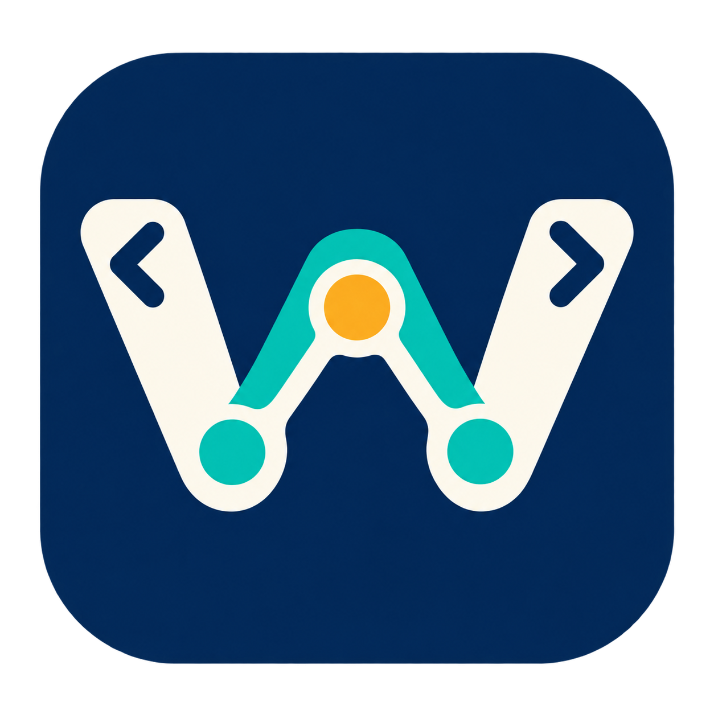

<a id="english"></a>

# Workweft



[](#english)
[](#中文)

[](https://github.com/QiushanHuang/Workweft/releases)
[](https://github.com/QiushanHuang/Workweft/releases)
[](LICENSE)

**Break a project into tasks. Let AI do the work. Review the results and track progress.**

Workweft is an AI project management app that runs on your computer. Break down
a project, arrange task dependencies, ask AI to generate documents, then inspect
the output beside the task and record what you decide to use. Return later and
see what is finished, what needs attention and what to do next.

It is built for work that takes more than one conversation. A brief changes, a
draft needs another pass, or you return to a project after a week away. Your next
step should start from the project's current state, not a search through old chats.

## Why choose Workweft?

Generating another answer is easy. Keeping track of which answer belongs to the
current plan takes more work. Workweft gives that work a home: tasks, execution
records, saved outputs and your decisions stay linked.

**The unit of progress is a task with a usable result, not a completed chat.**
You can see what is ready to start, what came back, what you checked and what
still needs attention. A result can be saved without being accepted; an older
version can remain useful without standing in for today's requirements.

| Friction in an everyday workflow | What Workweft changes | What you gain |
| --- | --- | --- |
| Requirements disappear into long chats. | Keep explicit criteria beside each task. | A clear definition of done before starting. |
| A task board shows status, while output and test results live elsewhere. | Link execution records and frozen results to the task. | Inspect what actually came back without reconstructing the run. |
| A revised task still points to an old "approved" file. | Bind artifacts and decisions to task versions. | Old results stay available without being mistaken for current acceptance. |
| It's hard to remember why you chose a result. | Save adopt/reject reasons and the checklist used at that time. | Search the decision, not just the filename. |
| Switching between files, plans and dependencies breaks concentration. | Use a board, dependency graph, Next Up view and file pointers together. | See what can move forward and what it needs. |

### A project workspace, alongside your agent harness

An **agent harness** is the execution layer around a model: it manages the loop
that calls the model and routes tool calls. Workweft works at
the project level, where a person decides what to do, which result to use and
whether the work is ready. This distinction follows the execution-layer meaning
of harness described in [Anthropic's architecture notes](https://www.anthropic.com/engineering/managed-agents).

| Layer | Main question | Role here |
| --- | --- | --- |
| Model | What should the next response or action be? | Produces reasoning, text and proposed actions |
| Agent harness / executor | How does the agent carry out this run? | Handles model/tool interaction and execution; this release uses local Codex CLI |
| Project workbench | What does this run mean for the project? | Connects tasks, dependencies, outputs, versions and your decisions |

The distinction is a focus, not an exclusive feature claim: an agent harness can
also keep plans and logs. This workbench makes the project record visible and
manageable for its owner, across individual runs. It complements an executor
rather than replacing it. Additional executor integrations are future work.

### Work you can pick up again

**Turn a brief into a deliverable.** Create a task for a launch plan or project
proposal. Write a few concrete criteria, generate a draft and check the saved
version. When the brief changes, the earlier draft and your reasoning remain
available while the revised task gets its own version.

**See the next step without rebuilding the plan.** Split a personal project into
tasks, connect the dependencies and open Next Up. The view uses task and
dependency state to suggest what can move forward. It is a practical starting
point when you return to a project, not another conversation to initialize.

**Review a small code change with its context intact.** For workbench Python
development, run a bounded change in an isolated copy. Inspect the patch and
independent test result next to the task's criteria, then record your decision.
Apply the selected change with your usual editor or Git workflow.

### What you keep

- **A navigable plan:** board and dependency views, with file pointers beside tasks.
- **Results with context:** a captured output keeps its source run and task version.
- **Decisions you can revisit:** search adoption/rejection reasons and the original checklist.
- **Readable project records:** Markdown for reading and JSON for structured exchange.

Keep your editor, terminal and file manager. Workweft organizes the work around
them. Version 0.4.0 is a single-user macOS workbench with a Simplified Chinese
interface. Document generation is available now; code execution is scoped to
registered workbench Python files. [MindDesk](https://github.com/QiushanHuang/MindDesk) integration uses explicit metadata
file exchange, not live synchronization.

## A quick tour

The workflow is **plan → execute → inspect → decide → continue**. Planning and
review are useful on their own; you do not need to launch an agent for every task.

| Need to… | Start here |
| --- | --- |
| Organize work | Create a project, then tasks with one criterion per line |
| See the order of work | Open **依赖图** (dependencies) or **下一步** (Next Up) |
| Ask the local agent for a document | Open **执行记录**, select the task and local document mode |
| Review a result | Choose **归档并进入验收**, then open its frozen content |
| Keep a decision | Check the criteria and record **采用** or **拒绝** with a reason |
| Mark the task accepted | Use **确认人工验收** after reviewing the current result |
| Find an earlier decision | Search **全局查找**, then open its task |
| Share project metadata | Export Markdown, JSON or [MindDesk](https://github.com/QiushanHuang/MindDesk)-compatible references |

"Adopt" records your choice. Applying a code patch remains a separate step in
your editor or Git workflow. Document acceptance is your judgement; code
acceptance also checks the recorded independent test result.

## Working modes

| Use it for | How you work | What stays with the project |
| --- | --- | --- |
| Planning and tracking | Create tasks, criteria, dependencies and file references without calling a model. | A persistent plan and visible next steps. |
| Document execution | Submit a task to local Codex and inspect the returned document. | Run status, saved output and its task version. |
| Bounded code execution | Choose allowed workbench Python paths and existing tests; run in an isolated copy. | A proposed patch and separate verification result. |
| Review and handover | Check a captured result, record a decision, search history or export project metadata. | The result you chose and the reasons behind it. |

These describe ways to use the product. The execution selector itself has two
modes: document and code. Planning, search and review are workspace views.

## Architecture in brief

The app separates **project rules**, **task execution** and **presentation**.
The native window and browser share the same interface and local service.

```text
Desktop window (Tauri) / browser (HTML, CSS, JavaScript)
                         │
                 Local Python HTTP service
                    ┌────┴─────┐
              Rust core      Python task runner → Codex CLI → model service
                 │                │
         SQLite project data   job records, outputs and test logs
                    └────┬─────┘
                Artifact capture and review
```

The Rust core validates state changes: dependency rules, task versions and
acceptance conditions. SQLite commits the updated snapshot and command history
in one transaction. A revision check rejects writes made against an outdated
view instead of silently replacing newer changes.

The Python runner manages execution separately. It retains job records and uses
an isolated work directory; finishing a run does not automatically accept a task.
When you capture a result, the artifact store saves a content-addressed JSON bundle.
Review ties that bundle back to the task version and your checklist.

| Technology | Why it is here |
| --- | --- |
| Rust + Serde | Typed commands and one place for project-state rules. |
| SQLite | Local persistence with transactional updates and no separate database server. |
| Python standard library | Loopback HTTP service, execution lifecycle, artifact storage and metadata search. |
| Tauri | A native macOS window around the shared workbench interface. |
| Codex CLI | The current executor for model-backed document and bounded code tasks. |
| JSON / Markdown | Structured records for programs and readable exports for people. |

Project records are stored on your computer. Model requests still use
the network through Codex. File pointers are not automatically read into a task.
See [development](docs/development.md) for module boundaries and build commands.

## Install

Download **Workweft-v0.4.0-macos-arm64.zip** from
[Releases](https://github.com/QiushanHuang/Workweft/releases/tag/v0.4.0).
Extract it and open the app, or move it to Applications first.

- Apple Silicon Mac. The bundle declares macOS 12+; validation used the maintainer's
  current macOS, not every supported OS version.
- Python 3.9+ is required by the local service. The app defaults to
  `/usr/bin/python3` (provided by Apple's command-line developer tools).
- Agent tasks need an installed, authenticated Codex CLI and Git. Planning and
  browsing saved records work without a model connection.
- This early-access build is ad-hoc signed, not Apple-notarized. Read
  [installation and troubleshooting](docs/guide.md#installation) before opening.

For the first run, create a small document task, add two concrete criteria and
follow the review steps above. Model execution uses your Codex account; its normal
network and usage terms apply.

## Build and develop

```sh
git clone https://github.com/QiushanHuang/Workweft.git
cd Workweft
cargo build --locked -p hct-core
python3 apps/workbench/server.py
```

Open **http://127.0.0.1:4178/**. Rust is needed for building; the browser workbench
uses Python's standard library. See [development](docs/development.md) for tests,
the macOS bundle and the module layout.

## Your data

Projects, task versions and decisions live in local SQLite databases. Captured
outputs and run logs are kept alongside them in
`~/Library/Application Support/local.harness.control/` on macOS.
File references register locations; adding a reference does not upload or scan
the file. Submitting an agent task sends its prompt and selected inputs through
your configured Codex service.

Markdown and JSON exports are readable project records. For a complete backup,
stop running tasks, quit the app and browser service, then copy the whole data
directory. See [backup and upgrades](docs/guide.md#backup-and-upgrades).

## Project and contributors

Created and maintained by **[Qiushan / QiushanHuang](https://github.com/QiushanHuang)**.
Built for independent developers, creators and anyone managing ongoing work with
AI. Product feedback is especially useful when it describes where a project loses
context, where a result becomes hard to find or what makes a task difficult to finish.

Contributions: [development guide](docs/development.md) ·
[issues](https://github.com/QiushanHuang/Workweft/issues) ·
[MIT license](LICENSE).

Next: patch preview/application with recovery, richer source navigation and
restore drills. See [release notes](CHANGELOG.md) for what ships today.

---

<a id="中文"></a>

## 简体中文

[](#english)
[](#中文)

**把项目拆成任务，交给 AI 执行，由你检查成果、掌握进度。**

Workweft 是一款运行在本地的 AI 项目管理工具。你可以拆解项目、安排任务顺序、
让 AI 生成文档，并在任务旁查看结果、记录采用或拒绝的理由、确认完成。
项目暂停后，也能看清已经做了什么、还有什么要做。

它适合那些“一次对话做不完”的工作：方案要反复修改，几个任务互相依赖，项目中断
几天后还要继续。重新打开时，你需要知道的是现在做到哪了、下一步做什么，而不是
从聊天记录里重新拼出整个项目。

### 为什么选 Workweft

AI 可以很快再给你一个答案，但哪个答案符合现在的要求、哪份结果已经检查过，仍然
需要有人理清。Workweft 把任务、执行记录、成果和你的决定放在同一条工作线上。

**这里的进展，是一项任务有了可用的结果，而不只是一次对话结束了。**
你可以看清哪些任务能开始、哪些结果待检查、哪些工作已经确认完成。结果可以先保存，
不必急着标记完成；旧版本也可以留下来参考，而不会混进当前任务的验收记录。

| 日常工作中的麻烦 | Workweft 的做法 | 实际收益 |
| --- | --- | --- |
| 要求散在聊天里，做到一半才发现遗漏。 | 把完成条件直接写进任务。 | 开始前说清楚，检查时有依据。 |
| 看板写着“完成”，却找不到对应的结果。 | 把执行记录和归档成果关联到任务。 | 从任务就能追到实际交付。 |
| 需求已经改了，还在沿用上一版的确认结果。 | 记录每份成果对应的任务版本。 | 旧稿留作参考，新要求重新检查。 |
| 文件还在，却忘了为什么选这一版。 | 保存采用或拒绝的理由，以及当时核对的条件。 | 找回的不只是文件，还有判断过程。 |
| 项目暂停几天，再回来不知道从哪继续。 | 用依赖关系和“下一步”视图梳理可推进的任务。 | 少花时间回忆，更快接着做。 |

### 它与 agent harness 有什么区别

通常所说的 **agent harness**，是围绕模型组织执行的那层软件，负责循环调用模型、
转交工具请求等工作。这里采用的是 [Anthropic 架构说明](https://www.anthropic.com/engineering/managed-agents)
中的这一含义。我们的产品则是面向人的项目工作台，关注一次执行如何服务于整个项目。

| 层次 | 主要解决什么问题 | 在这个产品中的角色 |
| --- | --- | --- |
| 模型 | 接下来应该回答什么、采取什么行动？ | 生成内容、推理和行动建议。 |
| Agent harness / 执行器 | 如何把这次任务执行下去？ | 组织模型与工具交互；当前版本通过本地 Codex CLI 执行。 |
| 项目工作台 | 该做什么，这次结果用不用，项目走到哪了？ | 管理任务、依赖、成果版本和人的决定。 |

两者的侧重点不同，也可以配合使用。有些 harness 同样具备计划和日志能力；我们的
特点是把项目记录做成使用者可以直接查看、管理和接着推进的工作界面。当前已接入
本地 Codex，更多执行器的接入留待后续版本。

### 把一个项目真正接着做下去

**从一个想法，做到一份可交付的方案。** 比如准备产品发布计划：先写清要包含哪些
内容，让 AI 生成初稿，检查归档版本，再记录采用理由。需求调整后，任务产生新版本，
原来的草稿和意见仍然保留，不必混在“最终版、最终修改版”几个文件名里辨认。

**隔几天回来，知道下一步从哪里开始。** 将个人项目拆成任务，安排依赖关系，再用
“下一步”查看当前可以推进的工作。这个视图根据已有状态和依赖给出建议，让你从
明确的任务继续，而不是先开一段对话重新解释背景。

**检查代码修改时，把要求和结果放在一起。** 开发工作台的 Python 功能时，可以让
执行器在独立副本中完成限定范围的修改。你查看补丁、独立测试结果和任务条件，记录
决定后，再通过熟悉的编辑器或 Git 工作流应用修改。

### 一个工作台，留下完整的工作线索

- **计划看得清：** 看板用于跟进状态，依赖图用于安排顺序，文件引用留在对应任务旁。
- **成果有来路：** 归档时保存结果快照，记录它来自哪次执行、对应哪一版任务。
- **选择有理由：** 采用和拒绝都能留下说明，之后可以连同当时的检查清单一起搜索。
- **记录带得走：** Markdown 方便阅读和交接，JSON 方便程序处理和后续集成。

你仍然使用熟悉的编辑器、终端和文件管理器，Workweft 负责把这些工作与项目对应起来。
0.4.0 是简体中文界面的单用户 macOS 工作台，已支持文档生成；代码执行目前限定
已登记的工作台 Python 文件。与 [MindDesk](https://github.com/QiushanHuang/MindDesk) 通过主动导入、导出交换元数据，不做后台实时同步。

### 快速上手

基本流程是：**规划 → 执行 → 检查 → 决定 → 继续推进**。你也可以只用它管理任务、
整理引用和检查已有结果，不必为每一步都调用 AI。

1. 创建项目和任务，验收条件每行写一条。
2. 用“依赖图”安排先后关系，在“下一步”看当前可推进的工作。
3. 打开“执行记录”，选择任务和本地文档模式，提交后查看运行状态。
4. 结果返回后，点击“归档并进入验收”，打开保存的结果快照，逐项检查。
5. 勾选已满足的条件，说明采用或拒绝的理由；确认当前结果符合要求后，点击“确认人工验收”。
6. 用“全局查找”查找任务、文件引用、成果来源和历史决定；需要交接时导出 Markdown 或 JSON。

“采用”会记录你的决定，代码补丁仍由你在编辑器或 Git 中应用。文档内容由你判断；
代码验收还会检查已记录的独立测试结果。任务修改后，旧结果继续保留，但不能直接
当作新版本的验收依据。

### 四种使用方式

| 你想做什么 | 怎么使用 | 项目中会留下什么 |
| --- | --- | --- |
| 规划和跟进 | 创建任务，写清完成条件，安排依赖，登记相关文件。 | 可持续更新的计划，以及明确的下一步。 |
| 生成文档 | 将任务交给本地 Codex，查看返回的文档。 | 执行状态、文档结果及对应的任务版本。 |
| 修改代码 | 指定允许修改的工作台 Python 文件和已有测试，在独立副本中执行。 | 待检查的补丁，以及单独记录的测试结果。 |
| 检查和交接 | 核对归档结果，记录选择，查询历史，导出项目记录。 | 采用了哪份成果，以及为什么采用。 |

这里介绍的是使用方式。界面的执行选项只有“文档”和“代码”两种模式；规划、查找和
验收则是工作台中的不同视图。

### 架构：把项目管理和任务执行分开

程序分为界面、本地服务、项目核心和执行器。桌面应用与浏览器使用同一套界面，
项目规则集中在核心中，具体执行由独立的运行模块负责。

```text
桌面窗口（Tauri）/ 浏览器（HTML、CSS、JavaScript）
                         │
                   本地 Python HTTP 服务
                    ┌────┴─────┐
               Rust 项目核心   Python 执行器 → Codex CLI → 模型服务
                    │               │
               SQLite 项目库    运行记录、输出和测试日志
                    └────┬─────┘
                    成果归档与验收
```

**项目核心负责“这次状态变化是否成立”。** 比如依赖是否满足、结果对应哪个任务版本，
以及当前条件是否允许验收。项目快照和操作记录在同一个数据库事务中保存；如果界面
数据已经过期，会提示刷新，避免较早的操作直接覆盖新状态。

**执行器负责“任务实际跑到了哪一步”。** 它在独立工作目录中执行任务，保存运行状态、
输出与日志。执行结束和人工验收是两件事：结果返回后，你可以先检查，再决定是否采用。
归档时，程序将结果与来源信息保存成 JSON 快照，随后将检查清单和决定关联到该版本。

| 关键技术 | 解决的问题 |
| --- | --- |
| Rust + Serde | 用明确的数据类型和命令管理项目规则，减少界面与执行器各自解释状态的情况。 |
| SQLite | 在本地持久保存项目，通过事务同步更新状态与操作记录，无需另装数据库服务。 |
| Python 标准库 | 提供本机 HTTP 服务，管理任务运行、成果归档和元数据搜索。 |
| Tauri | 将共享的网页界面放进原生 macOS 窗口。 |
| Codex CLI | 承担当前版本的文档生成和限定范围代码任务。 |
| JSON / Markdown | 同一份项目记录，既便于程序处理，也方便人阅读和交接。 |

项目记录保存在自己的设备上，并不是模型离线运行。提交 AI 任务时，
仍然通过 Codex 访问模型服务；登记的文件引用也不会自动变成模型输入。
模块位置与构建方法见[开发说明](docs/development.md)。

### 安装与运行

前往 [Releases](https://github.com/QiushanHuang/Workweft/releases/tag/v0.4.0)
下载 **Workweft-v0.4.0-macos-arm64.zip**，解压后打开应用，
也可以先移到 Applications。

- 当前安装包面向 Apple Silicon Mac，声明最低 macOS 12；尚未逐一验证所有系统版本。
- 本地服务需要 Python 3.9+，默认使用 Apple 命令行开发工具提供的 `/usr/bin/python3`。
- 执行 Agent 任务需要已登录的 Codex CLI 和 Git；只做项目规划、查看已有记录时不需要模型连接。
- 此版本是早期体验版，使用临时本地签名，尚未通过 Apple 公证。安装前请阅读
  [操作指南](docs/guide.md#中文操作说明)。

第一次使用，建议从一个小文档任务开始，写下两条明确的完成条件，再走完生成、检查
和确认的流程。模型执行使用你自己的 Codex 账号，遵循该服务的用量规则。

源码运行：

```sh
git clone https://github.com/QiushanHuang/Workweft.git
cd Workweft
cargo build --locked -p hct-core
python3 apps/workbench/server.py
```

随后打开 [本地工作台](http://127.0.0.1:4178/)。构建需要 Rust；浏览器服务使用 Python 标准库。

### 数据与备份

项目、任务版本和决定保存在本地 SQLite 中；归档产物、运行日志一起保存在：

```text
~/Library/Application Support/local.harness.control/
```

登记文件引用只记录位置，不会扫描或上传文件。提交 Agent 任务时，任务提示和所选
输入会通过 Codex 服务执行。Markdown/JSON 方便阅读和交接；完整备份需要先结束
运行任务、退出应用和浏览器服务，再复制整个数据目录。

### 作者与项目

作者与维护者：**[Qiushan / QiushanHuang](https://github.com/QiushanHuang)**。
面向独立开发者、内容创作者，以及需要持续使用 AI 推进项目的人。欢迎带着实际场景
提出建议：你在哪一步容易丢失上下文，哪份结果最难找，或者什么事情总让任务迟迟无法完成。

[开发说明](docs/development.md) · [版本记录](CHANGELOG.md) ·
[问题反馈](https://github.com/QiushanHuang/Workweft/issues) · [MIT 许可证](LICENSE)

后续重点是补丁预览与可恢复的应用、来源导航和恢复演练。

[返回 English ↑](#english)
